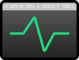

# Simple System Monitor



[](https://github.com/LGiki/gnome-shell-extension-simple-system-monitor/blob/master/LICENSE)

Simple system monitor extension for GNOME.

Show current CPU usage, memory usage and net speed on panel.

It only shows text like `U 1% M 23% ↓ 456 K/s ↑ 789 K/s` on the right part of panel.

For best experience, please use [monospaced font](https://en.wikipedia.org/wiki/Monospaced_font), e.g. [JetBrains Mono](https://www.jetbrains.com/lp/mono/), [Source Code Pro](https://adobe-fonts.github.io/source-code-pro/), [FiraCode](https://github.com/tonsky/FiraCode), [Hack](https://github.com/source-foundry/Hack).

# Screenshot


# Installation

- from GNOME extensions: [Simple System Monitor](https://extensions.gnome.org/extension/4506/simple-system-monitor/)

- from AUR: [gnome-shell-extension-simple-system-monitor](https://aur.archlinux.org/packages/gnome-shell-extension-simple-system-monitor/)

# Build

Use the following command to build this GNOME extension:

```bash
git clone https://github.com/LGiki/gnome-shell-extension-simple-system-monitor.git
cd gnome-shell-extension-simple-system-monitor
./build.sh
```

After successful build, the `ssm-gnome@lgiki.net.shell-extension.zip` file will be generated. You can use the following command to install the built GNOME extension:

```bash
gnome-extensions install ssm-gnome\@lgiki.net.shell-extension.zip --force
```

# License

[GPL-2.0](https://github.com/LGiki/gnome-shell-extension-simple-system-monitor/blob/master/LICENSE)

# References

- [https://github.com/AlynxZhou/gnome-shell-extension-net-speed](https://github.com/AlynxZhou/gnome-shell-extension-net-speed)

